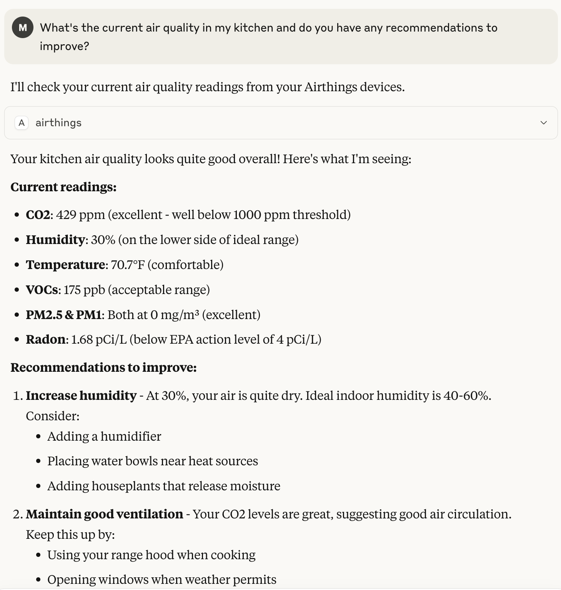

# Airthings Consumer MCP Server

[](https://www.npmjs.com/package/airthings-consumer-mcp)
[](https://www.npmjs.com/package/airthings-consumer-mcp)
[](https://www.npmjs.com/package/airthings-consumer-mcp)
[](https://deepwiki.com/michaelahern/airthings-consumer-mcp)

A Model Context Protocol (MCP) server for Airthings air quality monitoring devices.

## Claude Desktop

[claude_desktop_config.json](https://modelcontextprotocol.io/quickstart/user)

```json
{
  "mcpServers": {
    "airthings": {
      "command": "npx",
      "args": ["-y", "airthings-consumer-mcp"],
      "env": {
        "AIRTHINGS_CLIENT_ID": "[AIRTHINGS_CLIENT_ID]",
        "AIRTHINGS_CLIENT_SECRET": "[AIRTHINGS_CLIENT_SECRET]"
      }
    }
  }
}
```



## Claude Code

Config: [`.mcp.json`](.mcp.json)

```text
$ claude
╭───────────────────────────────────────────────────╮
│ ✻ Welcome to Claude Code!                         │
│                                                   │
│   /help for help, /status for your current setup  │
│                                                   │
│   cwd: /workspaces/airthings-consumer-mcp         │
╰───────────────────────────────────────────────────╯

> Use #airthings to get the current indoor air quality and provide an opinion on the current readings.

● Kitchen Air Quality - Very Good

  Excellent readings:
  - Radon: 0.89 pCi/L (well below EPA action level)
  - CO2: 465 ppm (good ventilation)
  - Temperature: 69.6°F (comfortable)
  - VOCs: 114 ppb (improved from earlier, good level)

  Good readings:
  - PM2.5/PM1: 2 mg/m³ (low particulate matter)

  Needs attention:
  - Humidity: 34% (still low - add moisture to reach 40-60%)

  Bedroom device appears offline or not reporting data.
```

## Amazon Q

Config: [`.amazonq/mcp.json`](.amazonq/mcp.json)

```text
$ q
✓ airthings_consumer_mcp loaded in 0.95 s


    ⢠⣶⣶⣦⠀⠀⠀⠀⠀⠀⠀⠀⠀⠀⠀⠀⠀⠀⠀⠀⠀⠀⠀⠀⠀⠀⠀⠀⠀⠀⠀⠀⠀⠀⠀⠀⠀⠀⠀⠀⠀⠀⠀⠀⠀⠀⠀⠀⠀⠀⠀⠀⠀⠀⠀⠀⠀⠀⠀⠀⠀⠀⠀⠀⢀⣤⣶⣿⣿⣿⣶⣦⡀⠀
 ⠀⠀⠀⣾⡿⢻⣿⡆⠀⠀⠀⢀⣄⡄⢀⣠⣤⣤⡀⢀⣠⣤⣤⡀⠀⠀⢀⣠⣤⣤⣤⣄⠀⠀⢀⣤⣤⣤⣤⣤⣤⡀⠀⠀⣀⣤⣤⣤⣀⠀⠀⠀⢠⣤⡀⣀⣤⣤⣄⡀⠀⠀⠀⠀⠀⠀⢠⣿⣿⠋⠀⠀⠀⠙⣿⣿⡆
 ⠀⠀⣼⣿⠇⠀⣿⣿⡄⠀⠀⢸⣿⣿⠛⠉⠻⣿⣿⠛⠉⠛⣿⣿⠀⠀⠘⠛⠉⠉⠻⣿⣧⠀⠈⠛⠛⠛⣻⣿⡿⠀⢀⣾⣿⠛⠉⠻⣿⣷⡀⠀⢸⣿⡟⠛⠉⢻⣿⣷⠀⠀⠀⠀⠀⠀⣼⣿⡏⠀⠀⠀⠀⠀⢸⣿⣿
 ⠀⢰⣿⣿⣤⣤⣼⣿⣷⠀⠀⢸⣿⣿⠀⠀⠀⣿⣿⠀⠀⠀⣿⣿⠀⠀⢀⣴⣶⣶⣶⣿⣿⠀⠀⠀⣠⣾⡿⠋⠀⠀⢸⣿⣿⠀⠀⠀⣿⣿⡇⠀⢸⣿⡇⠀⠀⢸⣿⣿⠀⠀⠀⠀⠀⠀⢹⣿⣇⠀⠀⠀⠀⠀⢸⣿⡿
 ⢀⣿⣿⠋⠉⠉⠉⢻⣿⣇⠀⢸⣿⣿⠀⠀⠀⣿⣿⠀⠀⠀⣿⣿⠀⠀⣿⣿⡀⠀⣠⣿⣿⠀⢀⣴⣿⣋⣀⣀⣀⡀⠘⣿⣿⣄⣀⣠⣿⣿⠃⠀⢸⣿⡇⠀⠀⢸⣿⣿⠀⠀⠀⠀⠀⠀⠈⢿⣿⣦⣀⣀⣀⣴⣿⡿⠃
 ⠚⠛⠋⠀⠀⠀⠀⠘⠛⠛⠀⠘⠛⠛⠀⠀⠀⠛⠛⠀⠀⠀⠛⠛⠀⠀⠙⠻⠿⠟⠋⠛⠛⠀⠘⠛⠛⠛⠛⠛⠛⠃⠀⠈⠛⠿⠿⠿⠛⠁⠀⠀⠘⠛⠃⠀⠀⠘⠛⠛⠀⠀⠀⠀⠀⠀⠀⠀⠙⠛⠿⢿⣿⣿⣋⠀⠀
 ⠀⠀⠀⠀⠀⠀⠀⠀⠀⠀⠀⠀⠀⠀⠀⠀⠀⠀⠀⠀⠀⠀⠀⠀⠀⠀⠀⠀⠀⠀⠀⠀⠀⠀⠀⠀⠀⠀⠀⠀⠀⠀⠀⠀⠀⠀⠀⠀⠀⠀⠀⠀⠀⠀⠀⠀⠀⠀⠀⠀⠀⠀⠀⠀⠀⠀⠀⠀⠀⠀⠀⠀⠈⠛⠿⢿⡧

╭─────────────────────────────── Did you know? ────────────────────────────────╮
│                                                                              │
│        You can enable custom tools with MCP servers. Learn more with         │
│                                    /help                                     │
│                                                                              │
╰──────────────────────────────────────────────────────────────────────────────╯

/help all commands  •  ctrl + j new lines  •  ctrl + s fuzzy search
━━━━━━━━━━━━━━━━━━━━━━━━━━━━━━━━━━━━━━━━━━━━━━━━━━━━━━━━━━━━━━━━━━━━━━━━━━━━━━━━
🤖 You are chatting with claude-4-sonnet

> Use #airthings to get the current indoor air quality and provide an opinion on the current readings.

> I'll get the current air quality readings from your Airthings devices and provide an analysis.

🛠️  Using tool: airthings from mcp server airthings_consumer_mcp
 ⋮ 
 ● Running airthings with the param:
 ⋮  {
 ⋮    "arguments": {},
 ⋮    "name": "airthings"
 ⋮  }

> ## Kitchen Air Quality - Very Good Overall

Excellent readings:
• **Radon**: 0.89 pCi/L (well below EPA action level of 4 pCi/L)
• **CO2**: 465 ppm (good ventilation - below 600 ppm is ideal)
• **Temperature**: 69.6°F (comfortable range)
• **VOCs**: 114 ppb (good level for indoor air)

Good readings:
• **PM2.5/PM1**: 2 mg/m³ (low particulate matter levels)
• **Pressure**: 79,226 Pa (normal atmospheric pressure)

Needs attention:
• **Humidity**: 34% (low - ideal range is 40-60% for comfort and health)

Recommendations:
• Consider adding a humidifier to bring humidity up to the 40-60% range
• The low humidity could cause dry skin, respiratory irritation, and static electricity
• All other readings indicate excellent air quality with good ventilation

Bedroom Status:
• Device appears offline or not reporting data - you may want to check the device connection or battery status

Overall, your kitchen has excellent air quality with just the humidity needing some attention!
```
